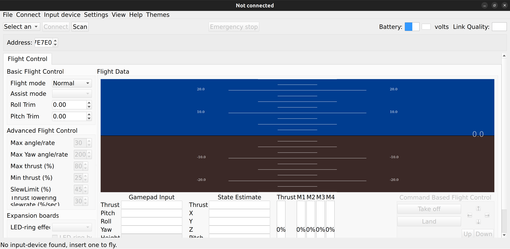

# Setting up the Bitcraze Client on Ubuntu 22.04 VM on Mac
*Authored by [Puru Soni](https://github.com/puru-soni-04) (purusoni@buffalo.edu) on Aug 24, 2023*
***

# Introduction
We would be following the [official Bitcraze Client documentation](https://www.bitcraze.io/documentation/repository/bitcraze-client-python/master/getting_started/) to setup the Bitcraze Client on our Mac.

# Installing Python 3.10
1. Python 3.10 should already be installed on Ubuntu 22.04. To check if it is installed, run the following command in the terminal:

    ```
    python3 --version
    ```
2. If Python 3.10 is not installed, search online to find out how to install it on Ubuntu 22.04.

# Installing the Bitcraze Client
1. **We found a bug** with the Bitcraze Client that prevents it from working with default PyQt5 insallation. To fix this bug, run the following command in the terminal:

    ``` bash
    sudo apt-get remove python3-pyqt5
    pip3 install PyQt5
    ```

2. Follow the steps here to access Crazyradio PA without being root https://www.bitcraze.io/documentation/repository/crazyflie-lib-python/master/installation/usb_permissions/


3. Install the Bitcraze Client by running the following command in the terminal:

    ``` bash
    pip3 install cfclient
    ```

4. Run the Bitcraze Client by running the following command in the terminal:

    ``` bash
    cfclient
    ```

You should see the following window:
    


Figure: Screenshot of the Bitcraze Client

6. Follow the steps here to configure the Bitcraze Client and connect to the Crazyflie https://www.bitcraze.io/documentation/tutorials/getting-started-with-crazyflie-2-x/#config-client


# You are all set!
Congratulations! You have successfully installed the Bitcraze Client on your Mac.

***
Note: Please feel free to add to this guide. Include your name and email address to the top of this file if you contribute to this guide.