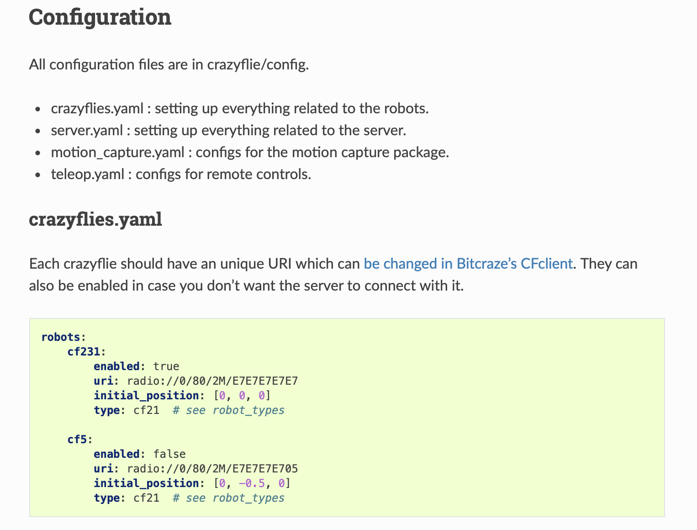

# Setting up Crazyswarm 2  and ROS 2 Humble on Ubuntu 22.04 VM on Mac
*Authored by [Puru Soni](https://github.com/puru-soni-04) (purusoni@buffalo.edu) on Aug 24, 2023*
***

# Introduction
We would be following the [official Crazyswarm 2 documentation](https://imrclab.github.io/crazyswarm2/) to setup Crazyswarm 2 and ROS 2 Humble on our Mac.

# Installing ROS 2 Humble
>*Follow the [official Crazyswarm 2 documentation](https://imrclab.github.io/crazyswarm2/) to install ROS 2 Humble, it should have a link to the official ROS 2 Humble documentation, or click [here](https://docs.ros.org/en/humble/Installation.html)*

# Installing Crazyswarm 2
>*Follow the [official Crazyswarm 2 documentation](https://imrclab.github.io/crazyswarm2/) to install Crazyswarm 2*

Note: Dont forget to change the default address of Crazyflies in crazyflie.yaml to `radio://0/80/2M/E7E7E7E7E7` (or whatever address you are using) before running crazyswarm2. 

Figure: Screenshot from the official Crazyswarm 2 documentation

# Running Crazyswarm 2
>*Follow the [official Crazyswarm 2 documentation](https://imrclab.github.io/crazyswarm2/) to run Crazyswarm 2*

***
Note: Please feel free to add to this guide. Include your name and email address to the top of this file if you contribute to this guide.
