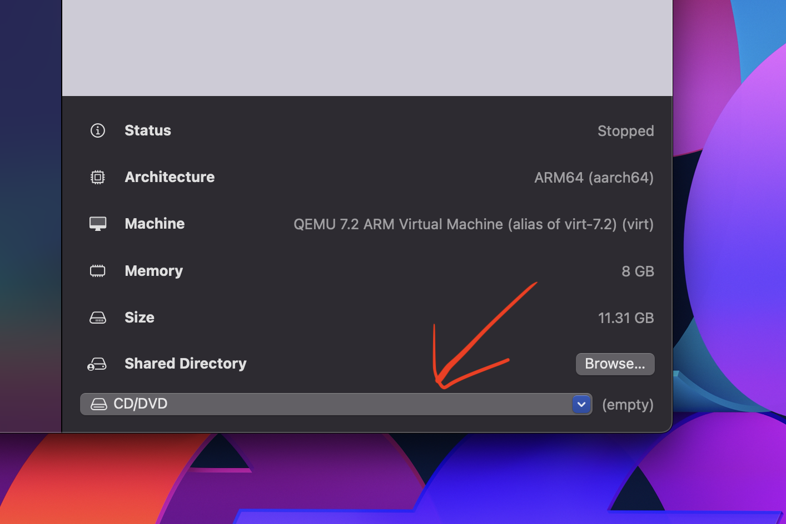

# Installing (the best) Virtual Machine for Mac, and Ubuntu (22.04)
*Authored by [Puru Soni](https://github.com/puru-soni-04) (purusoni@buffalo.edu) on Aug 24, 2023*
***

# Introduction 
We will be using a Virtual Machine to run Ubuntu 22.04 on our Mac. There are many Virtual Machines available for Mac, but we will be using [UTM](https://mac.getutm.app/). UTM is a free and open-source virtual machine that lets you run any operating system on your Mac. It is a very powerful virtual machine and is very easy to use.

From [UTM's Website](https://mac.getutm.app/): 
> UTM employs Apple's Hypervisor virtualization framework to run ARM64 operating systems on Apple Silicon at near native speeds. On Intel Macs, x86/x64 operating system can be virtualized. In addition, lower performance emulation is available to run x86/x64 on Apple Silicon as well as ARM64 on Intel. For developers and enthusiasts, there are dozens of other emulated processors as well including: ARM32, MIPS, PPC, and RISC-V. Your Mac can now truly run anything.

# Installing UTM
1. Go to [UTM's Website](https://mac.getutm.app/) and download the latest version of UTM.
2. Open the downloaded file and follow the instructions to install UTM.

# Installing Ubuntu (22.04)
We would need to install the Version of Ubuntu that matches the system architecture of our Mac.

It should either be `amd64 (also known as X86-64)` or `arm64`. 

`amd64` is for Intel Macs and `arm64` is for Apple Silicon Macs.

If you are not sure search online to find out which one is the correct one for your Mac.


## For Apple Silicon Macs (arm64)
1. Go to https://cdimage.ubuntu.com/jammy/daily-live/current/ (must use this website, the ARM .iso is not public) and download the latest version of Ubuntu (22.04) for `arm64`. Direct link: https://cdimage.ubuntu.com/jammy/daily-live/current/jammy-desktop-arm64.iso

2. Open UTM and click on the `+` icon.

3. Click on `Virtualize` and then click on `Linux`.

4. Without changing anything else, click on `Browse` in the `Boot ISO Image` section.

5. Select the Ubuntu .iso file that you downloaded in step 1 and click continue.

6. Allocate at least 8GB of RAM to the virtual machine. (I would recommend 12GB, if possible)

7. Optionally, you can control the number of CPU cores to allocate to the virtual machine. (I would recommend leaving it at `Default`).

8. Click continue.

9. Specify the amount of storage you want to allocate to the virtual machine. (I would recommend at least 64GB)

10. Skip the `Shared Directories` section (for now, you may configure it later if you wish) and click continue.

11. Review the settings and click on save.

12. You will be taken to the main screen of UTM. Click on the virtual machine you just created and click on `Start` or the play button.

13. You will be taken to the Ubuntu installer. Click on `Try or install Ubuntu`.

14. Once Ubuntu boots up, click on the `Install Ubuntu` icon on the desktop. Cofigure setting and click continue until you reach the Updates page.

15. You **MUST** disable the `Download updates while installing Ubuntu` option during the installation process.

16. For the `Installation type` option, select `Erase disk and install Ubuntu` and click continue. (This will erase the virtual disk that we created in step 9).

17. Click on `Install Now` and click continue. Set a username and password and click continue.

18. Once the installation is complete, click on `Restart Now`.

19. Close the VM (or somehow exit it) and click on the `CD/DVD` drop down menu in UTM and select `Clear`. (This will remove the Ubuntu .iso file from the virtual machine so that it does not boot from the .iso file again).


<br>
<br>

20. Click on `Start` or the play button to start the virtual machine again.

21. Open a terminal and run the following command to update Ubuntu:

    ``` bash
    sudo apt update
    sudo apt upgrade 
    ```

21. Congratulations! You have successfully installed Ubuntu on your Mac.


## For Intel Macs (amd64)
Although not tested yet, you can try to install the `arm64` version of Ubuntu on your Intel Mac. The steps after download should be the same as the ones for Apple Silicon Macs. (Please add instructions for Intel Macs if you are able to install Ubuntu on your Intel Mac)

1. Go to [Ubuntu's website](https://releases.ubuntu.com/jammy/) for version 22.04 and download the AMD64 version of Ubuntu. Direct link: https://releases.ubuntu.com/jammy/ubuntu-22.04.3-desktop-amd64.iso

2. Follow the same steps as above.


***
Note: Please feel free to add to this guide. Include your name and email address to the top of this file if you contribute to this guide.